<!-- ═══════════════ HERO ═══════════════ -->

  

  <h3>I build AI-powered, scalable full-stack web apps that automate repetitive work.</h3>

  
  
   
  
  

 

<!-- ═══════════════ ABOUT ═══════════════ -->

<table align="center">
  <tr>
    <td align="center" width="230">
      
        
      <b>Muhammad Ali</b> 
      Web Developer
        
      
    </td>
    <td>
      Web developer building <b>AI-powered, scalable full-stack applications</b>. I automate repetitive tasks and workflows using <b>LLM APIs</b>, <b>REST integrations</b> and clean backend architecture, paired with a seamless React front end.
        
      🔭 &nbsp;<b>Currently</b> &nbsp; Building AI-powered full-stack web apps 
      🎯 &nbsp;<b>Focus</b> &nbsp; Workflow automation &amp; task orchestration 
      🌱 &nbsp;<b>Exploring</b> &nbsp; RAG pipelines, AI agents &amp; tool calling 
      📍 &nbsp;<b>Location</b> &nbsp; Your City, Country 
      ⚡ &nbsp;<b>Fun fact</b> &nbsp; I enjoy turning messy ideas into working software
        
      💬 &nbsp;<i>"If a task is repetitive, it can be automated."</i>
    </td>
  </tr>
</table>

 

<!-- ═══════════════ SKILLS ═══════════════ -->

**Languages**

**Frameworks & Runtime**

**Dev Tools**

**AI & Automation**

 

<!-- ═══════════════ PROJECTS ═══════════════ -->

<table>
  <tr>
    <td>
      
    </td>
    <td>
      
    </td>
  </tr>
  <tr>
    <td>
      
    </td>
    <td>
      
    </td>
  </tr>
</table>
A small selection of my best work. Quality over quantity.

 

<!-- ═══════════════ STATS ═══════════════ -->

  
  
   
  
  
  
   
  

 

<!-- ═══════════════ CONTACT ═══════════════ -->

  
  
  

 

